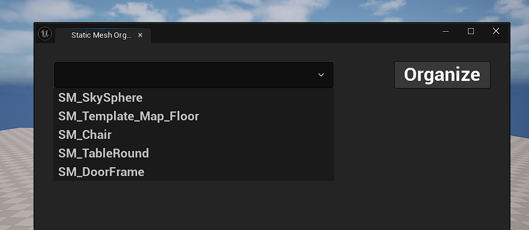
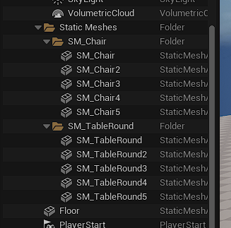

# Static Mesh Organizer

The Static Mesh Organizer is a tool for Unreal Engine that lets the user select a static mesh \
and put all StaticMeshActors in the level that have that Static Mesh into a folder

## Custom Module

[CustomTools]("./TechDirectionFinal/Source/CustomTools/Private/CustomTool.cpp")
A custom module made to only run in the UE editor that adds a Custom Tool tab to the menu bar

* Static Mesh Organizer: Once clicked, it will create a custom editor window

## Static Mesh Organizer Window

[StaticMeshSelector]("./TechDirectionFinal/Source/CustomTools/Private/StaticMeshOrganizer.cpp")
An Editor Utility Widget that lets the user select a static mesh and put the\
StaticMeshActors in the level with the selected static mesh into a folder

* **EditorUtilityComboBox:** A dropdown menu that will show all the static mesh assets in the level.\
  Allows the user to select which static mesh to organize

* **Organize Button:** Once clicked, it will organize the StaticMeshActors of the selected static mesh\
  into a folder that's named after the static mesh

  
